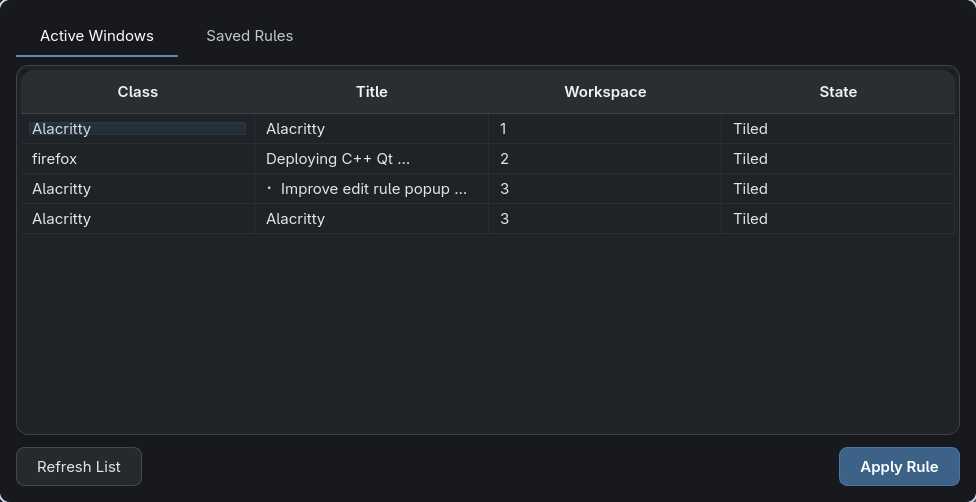
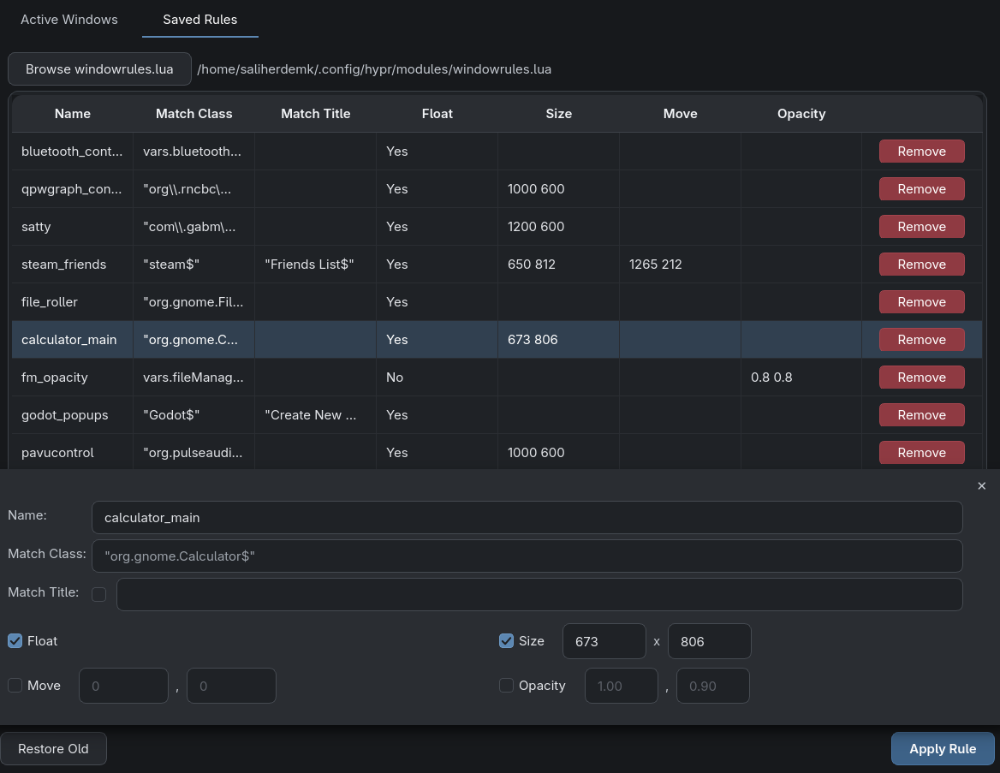

<p align="center">
  
</p>

<h1 align="center">Mozaik</h1>

<p align="center">A Qt6 GUI for managing Hyprland window rules stored in a Lua config.</p>





- **Active Windows** tab lists all open windows via `hyprctl clients`. Selecting one focuses it and pre-fills a rule form with its class and title.
- **Saved Rules** tab shows every rule parsed from your `windowrules.lua`, editable in place or removable.
- The rule form supports float, size, move, and opacity (active/inactive) attributes, with class/title regex matching.
- **Apply Rule** rewrites the config file (the previous version is kept as `windowrules_old.lua`) and runs `hyprctl reload`. **Restore Old** swaps the backup back.

## Requirements

- Hyprland with a Lua-based config (ie. Hyprland > 0.55)
- Qt 6
- CMake

## Build

```sh
cmake -B build
cmake --build build
./build/Mozaik
```

## Usage


On first launch you'll be asked to pick your `windowrules.lua`. The choice is remembered.

Pick a window, tweak the rule form, hit **Apply Rule**.


> [!WARNING]
> **Mozaik rewrites the whole rules file on every save.** If your window rules currently live inside `hyprland.lua`, move them into a separate file first — otherwise the rest of your config would be overwritten.

Keep your window rules in their own file, separate from `hyprland.lua`:

```
~/.config/hypr
├── hyprland.lua
└── modules
    └── windowrules.lua
```

Then load them from `hyprland.lua`:

```lua
require("modules.windowrules")
```

When Mozaik rewrites `windowrules.lua`, it keeps everything above the first `hl.window_rule` block untouched and regenerates only the rule blocks below it. That means `require` statements and variables at the top of the file survive every save:

```lua
local vars = require("modules.variables")

hl.window_rule({
  name = "bluetooth_control",
  float = true,
  match = { class = vars.bluetoothGui },
})
```

If you use variables in your rules, just define them above the first `hl.window_rule` and they'll be preserved.
